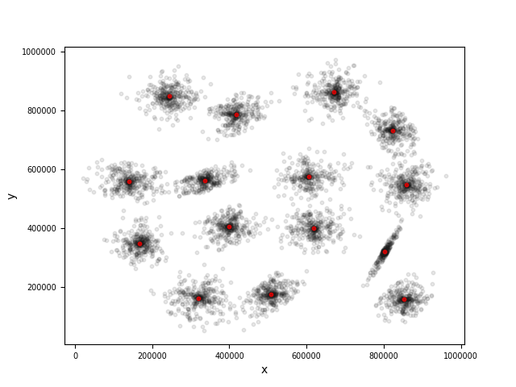
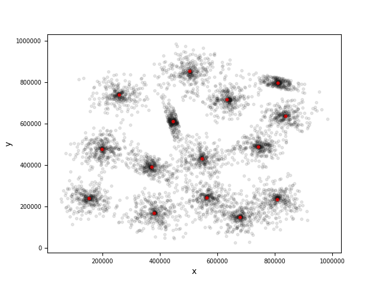
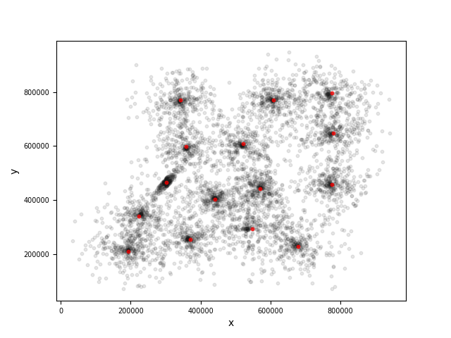
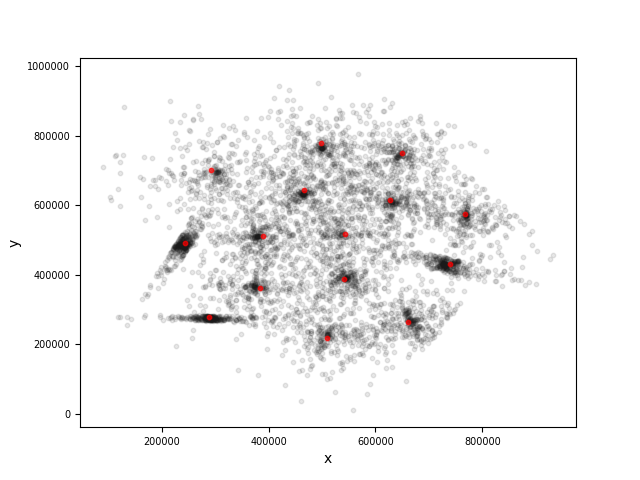

Data retrieved from http://cs.joensuu.fi/sipu/datasets/

**Results**

We used python to visualize computed results, as follows. Where balck dots are original samples and red dots are computed cluster centers.

**Reflections:**

We create classes for different entities in K-means algo, a.k.a, Samples, Clusters and added KMean class, which includes one random pick for K samples and assiginment for each sample to the closest cluster. The Main class was only used to seperate the reading logic from data files and also the iteration to run K-means a number of times, maybe should create a Reader class instead.
