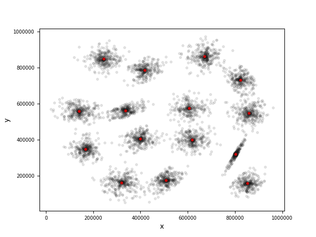
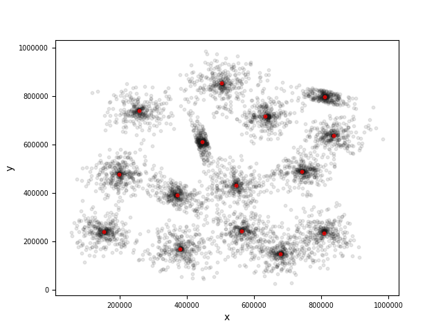
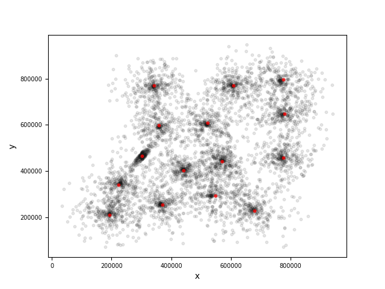

Data retrieved from http://cs.joensuu.fi/sipu/datasets/

**Results**

Cluter centers are written to `result/s1-cb.txt`, `result/s2-cb.txt`, `result/s3-cb.txt` and `result/s4-cb.txt`, after running the `Main.java` class.

We also wrote a python script `plotter.py` to the visualize computed results, where original samples were plotted as black dots and computed cluster centers were plotted red.

To regenerate diagrams based on new results, simply run ```python plotter.py```






**Reflections:**

We create classes for different entities in K-means algo, a.k.a, Samples, Clusters and added KMean class, which includes one random pick for K samples and assiginment for each sample to the closest cluster. The Main class was only used to seperate the reading logic from data files and also the iteration to run K-means a number of times, maybe should create a Reader class instead.
